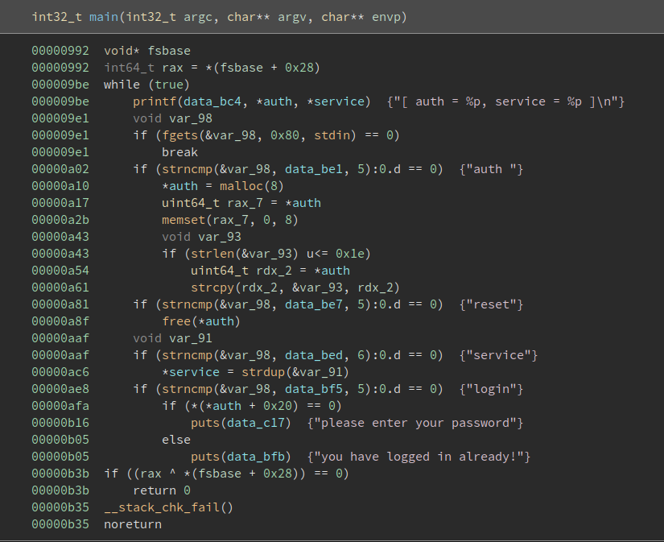

# Protostar Heap2
This challenge is broken an has an unintended solution, the intended one is a Use After Free. The objective is to **print** the message *you have logged in already!*.

## Binary
### Code
Decompiled with Binary Ninja HLIL.



### Security 
All the protections are enabled.

```shell
$ checksec ./heap2
    Arch:     amd64-64-little
    RELRO:    Full RELRO
    Stack:    Canary found
    NX:       NX enabled
    PIE:      PIE enabled
```

## Solution
Overwrite **auth+0x20** with a value different than 0.

### Unintended
If we check the real code the author intended that the malloc for auth was of the size of the following struct.
```c
struct auth {
  char name[32];
  int auth;
};
```
But since the code is naming *auth* a lot of different variables the size used in malloc is 8 which is not intended.

So if we just do an *auth* command followed by a *service* command, the heap chunk for *service* will be at exactly *auth+0x20*.

#### Heap chunks
```shell
gef➤  dereference 0x55aa796c86c0-0x10
0x000055aa796c86b0│+0x0000: 0x0000000000000000
0x000055aa796c86b8│+0x0008: 0x0000000000000021      <-------auth chunk
0x000055aa796c86c0│+0x0010: 0x0000000a72657375 ("user\n"?)
0x000055aa796c86c8│+0x0018: 0x0000000000000000
0x000055aa796c86d0│+0x0020: 0x0000000000000000
0x000055aa796c86d8│+0x0028: 0x0000000000000021      <-------service chunk
0x000055aa796c86e0│+0x0030: "thing_after_service\n" <-------auth+0x20
0x000055aa796c86e8│+0x0038: "fter_service\n"
0x000055aa796c86f0│+0x0040: 0x0000000a65636976 ("vice\n"?)
0x000055aa796c86f8│+0x0048: 0x000000000001f911
```
If we now issue a *login* command we will get the message *you have logged in already!*

### Intended
If we patch the binary so now it uses the correct size for malloc we can see that the unintended solution does not work anymore.

#### Heap chunks unintended solution
```shell
gef➤  dereference 0x56347a8046c0-0x10 12
0x000056347a8046b0│+0x0000: 0x0000000000000000
0x000056347a8046b8│+0x0008: 0x0000000000000031      <-------auth chunk
0x000056347a8046c0│+0x0010: 0x0000000a72657375 ("user\n"?)
0x000056347a8046c8│+0x0018: 0x0000000000000000
0x000056347a8046d0│+0x0020: 0x0000000000000000
0x000056347a8046d8│+0x0028: 0x0000000000000000
0x000056347a8046e0│+0x0030: 0x0000000000000000      <-------auth+0x20
0x000056347a8046e8│+0x0038: 0x0000000000000021      <-------service chunk
0x000056347a8046f0│+0x0040: "thing_after_service\n"
0x000056347a8046f8│+0x0048: "fter_service\n"
0x000056347a804700│+0x0050: 0x0000000a65636976 ("vice\n"?)
0x000056347a804708│+0x0058: 0x000000000001f901
```
So what we have to do is issue an *auth* command and follow it with a *reset* command which will free the auth chunk.

After that we can issue a *service* command with an argument longer than 0x20 which will give us a chunk at the same address as the freed auth chunk.

Finally, since the *login* command is using the auth chunk after it has been freed and it now equals our service chunk. When it checks *auth+0x20* it's actually *service+0x20* which we control with our argument to the *service* command.

#### Heap chunks intended solution
```shell
gef➤  dereference 0x55f7561b66c0-0x10
0x000055f7561b66b0│+0x0000: 0x0000000000000000
0x000055f7561b66b8│+0x0008: 0x0000000000000031      <-------service chunk & freed auth chunk
0x000055f7561b66c0│+0x0010: "service_paddingAAAAAAAAAAAAAAAA\n"
0x000055f7561b66c8│+0x0018: "_paddingAAAAAAAAAAAAAAAA\n"
0x000055f7561b66d0│+0x0020: "AAAAAAAAAAAAAAAA\n"
0x000055f7561b66d8│+0x0028: "AAAAAAAA\n"
0x000055f7561b66e0│+0x0030: 0x000000000000000a      <-------auth+0x20
0x000055f7561b66e8│+0x0038: 0x000000000001f921
0x000055f7561b66f0│+0x0040: 0x0000000000000000
0x000055f7561b66f8│+0x0048: 0x0000000000000000
```
 So if we issue a *login* command we will get our desired message, *you have logged in already!*.